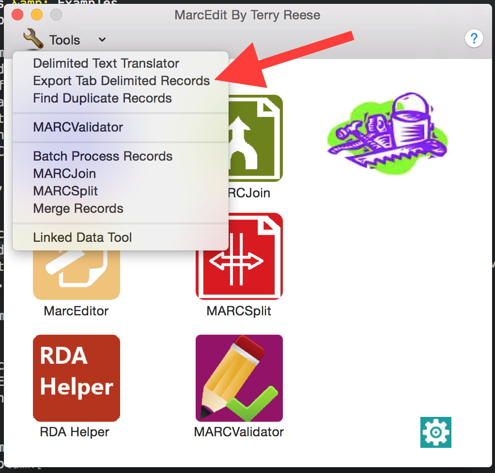
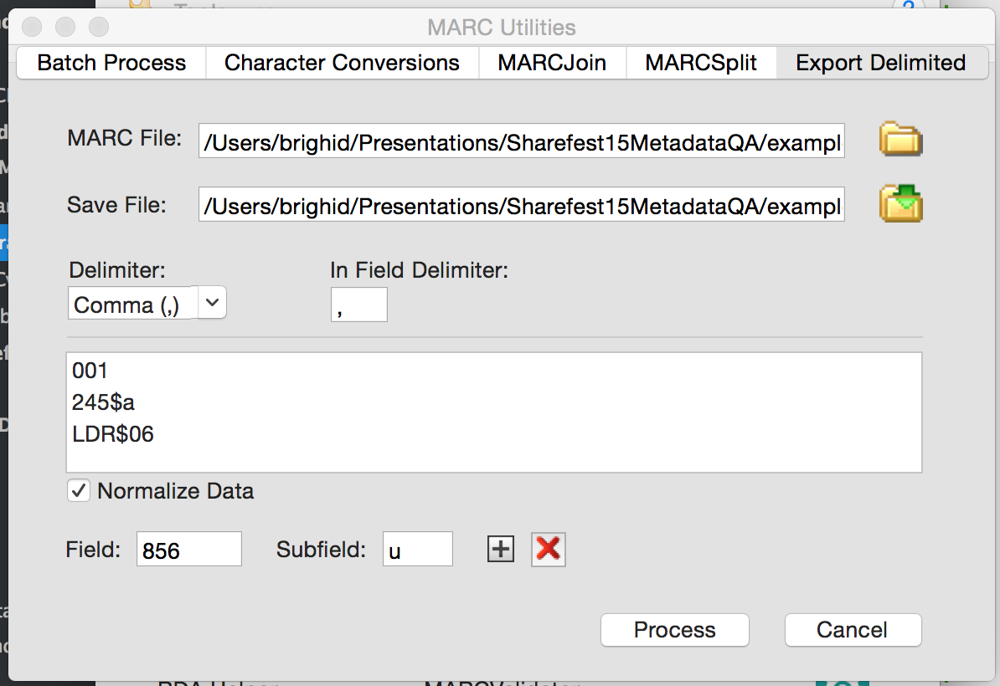

# Generating MARCEdit CSV Reports/Exports
_If you don't have MARCEdit installed, go to http://marcedit.reeset.net/downloads and follow the instructions for your operating system._

## About MARCEdit
MARCEdit displays MARC records using the [MARCBreaker format (.mrc)](http://www.loc.gov/marc/makrbrkr.html). The basics are given below:

### How MARCEdit presents MARC Records:
- Delimiters = $
- Blank indicator = \
- Field terminators in MARCEdit = at the beginning of each line/field
- Record terminators in MARCEdit are 1 blank Line between each MARC record. 
- Always 2 blank spaces between 3 digit field tag and indicator positions 
- In MARCEdit there always has to be $a to begin all variable fields - $a is NOT assumed.
- In MARCEdit there are no spaces between delimiter, subfield letter/number, text data. 

### Example:
=245 00$aText of marc field$h[electronic resource] :$bthe rest of the story /$cMickey Mouse.
=260 
$aCambridge :$bCambridge University Press,$c2011
=651 \0$aEurope$xHistory.
=856 40$uhttp://digital.films.com/PortalPlaylists.aspx?aid=17730&xtid=2669 
MARCEdit text record example: 
=LDR 01258nam a22003378a 4500
=001 CR9780511910616
=003 UkCbUP
=005 20120927050353.0
=006 m||||||||d||||||||
=007 cr||||||||||||
=008 100824s2011||||enk\\\\\s\\\\\||1\0|eng|d
=020 \\ $a 9780511910616 (ebook)
=020 \\ $a 9781107008045 (hardback)
=040 \\ $a UkCbUP$cUkCbUP
=050 00 $a QA248 $b .S4125 2012
=082 00 $a 510223
=245 00 $a Set Theory, Arithmetic, and Foundations of Mathematics $h[electronic resource] :$b Theorems, Philosophies /$cEdited by Juliette Kennedy, Roman Kossak.
=260 \\ $a Cambridge : $b Cambridge University Press, $c 2011
=300 \\ $a 1 online resource (242 p.) : $b digital, PDF file(s).
=490 0\ $a Lecture Notes in Logic $v no. 36
=500 \\ $a Title from publishers bibliographic system (viewed on 27 Sep 2012).
=530 \\ $a Also issued in print format.
=538 \\ $a Mode of access: World Wide Web.
=650 \0 $a Set theory.
=650 \0 $a Logic, Symbolic and mathematical.
=650 \0 $a Mathematics $x Philosophy.
=650 \7 $a MATHEMATICS / Logic. $2 bisacsh
=700 1\ $a Kennedy, Juliette.
=700 1\ $a Kossak, Roman.
=776 08 $i Print version: $z 9781107008045
=856 40 $u http://dx.doi.org/10.1017/CBO9780511910616 $z Access by subscription 

## Generate CSV Export/Reports
In the MARCEdit start screen:
1. Go Tools > Export Tab Delimited Records.

2. In the MARC File field, click the folder and find your binary MARC (.mrc) file. 
3. In the Save File field, click the folder, find where you want to save the output CSV report, then enter the name of that report.
4. Choose your delimiter options.
5. Then in the Field and Subfield fields below the text box, enter the MARC fields you wish to include in the CSV output, then hit the plus sign. This will add those fields to the text box. You can add Leader fields but putting in 'LDR' then subfield '06'.

6. When you've added all the fields you want, click on 'Process'. The CSV file is now saved to your computer.

