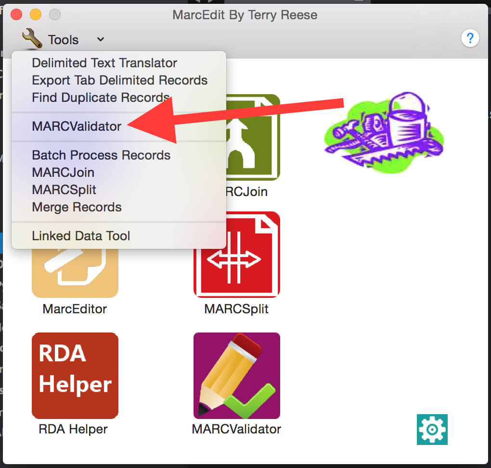

# Validating MARC Records in MARCEdit
_If you don't have MARCEdit installed, go to http://marcedit.reeset.net/downloads and follow the instructions for your operating system._

## About MARCEdit
MARCEdit displays MARC records using the [MARCBreaker format (.mrc)](http://www.loc.gov/marc/makrbrkr.html). The basics are given below:

### How MARCEdit presents MARC Records:
- Delimiters = $
- Blank indicator = \
- Field terminators in MARCEdit = at the beginning of each line/field
- Record terminators in MARCEdit are 1 blank Line between each MARC record. 
- Always 2 blank spaces between 3 digit field tag and indicator positions 
- In MARCEdit there always has to be $a to begin all variable fields - $a is NOT assumed.
- In MARCEdit there are no spaces between delimiter, subfield letter/number, text data. 

### Example:
=245 00$aText of marc field$h[electronic resource] :$bthe rest of the story /$cMickey Mouse.
=260 
$aCambridge :$bCambridge University Press,$c2011
=651 \0$aEurope$xHistory.
=856 40$uhttp://digital.films.com/PortalPlaylists.aspx?aid=17730&xtid=2669 
MARCEdit text record example: 
=LDR 01258nam a22003378a 4500
=001 CR9780511910616
=003 UkCbUP
=005 20120927050353.0
=006 m||||||||d||||||||
=007 cr||||||||||||
=008 100824s2011||||enk\\\\\s\\\\\||1\0|eng|d
=020 \\ $a 9780511910616 (ebook)
=020 \\ $a 9781107008045 (hardback)
=040 \\ $a UkCbUP$cUkCbUP
=050 00 $a QA248 $b .S4125 2012
=082 00 $a 510223
=245 00 $a Set Theory, Arithmetic, and Foundations of Mathematics $h[electronic resource] :$b Theorems, Philosophies /$cEdited by Juliette Kennedy, Roman Kossak.
=260 \\ $a Cambridge : $b Cambridge University Press, $c 2011
=300 \\ $a 1 online resource (242 p.) : $b digital, PDF file(s).
=490 0\ $a Lecture Notes in Logic $v no. 36
=500 \\ $a Title from publishers bibliographic system (viewed on 27 Sep 2012).
=530 \\ $a Also issued in print format.
=538 \\ $a Mode of access: World Wide Web.
=650 \0 $a Set theory.
=650 \0 $a Logic, Symbolic and mathematical.
=650 \0 $a Mathematics $x Philosophy.
=650 \7 $a MATHEMATICS / Logic. $2 bisacsh
=700 1\ $a Kennedy, Juliette.
=700 1\ $a Kossak, Roman.
=776 08 $i Print version: $z 9781107008045
=856 40 $u http://dx.doi.org/10.1017/CBO9780511910616 $z Access by subscription 

## Validating MARC Records
In the MARCEdit start screen:
1. Go to Tools > MARCValidator

2. Choose the binary MARC file you wish to validate.
3. Choose the rules file you wish to validate against - the MARCEdit default works for standard MARC records. See below for writing your own MARC validation file.
4. Click on Validate Record. What will appear are the record identifier, record titles, and the invalid field(s).

## Making Your Own MARC Validation File
1. Find the MARCEdit standard validation file - if you're uncertain where this is on your computer, open the MARCValidator tool, and note where the default rules are kept.
2. Change into that directory, and make a copy of marcrules.txt - something like 'ebooksmarcrules.txt'.
3. Leaving marcrules.txt intact, open 'ebooksmarcrules.txt' in your preferred text editor (not a word processor like Microsoft Word).
4. Add local fields, following the format exemplified below:

Basic Field Overview:
```
### R   FIELD TITLE/INFORMATION (R = Repeatable, NR = Not Repeatable)
valida  [^0-9x] Valid Characters for subfielda
ind1    blank   Indicator options if defined
ind2    blank   Indicator options if defined
a   NR  Subfield A (not repeatable) checked against valida above
b   R  Subfield B (repeatable)
```

Field Example:
```
020 R   INTERNATIONAL STANDARD BOOK NUMBER
valida  [^0-9x] Valid Characters
validz  [^0-9x] Valid Characters
ind1    blank   Undefined
ind2    blank   Undefined
a   NR  International Standard Book Number
c   NR  Terms of availability
z   R   Canceled/invalid ISBN
6   NR  Linkage
8   R   Field link and sequence number
```

Local Field Addition Example:
```
945 R   ALMA ELECTRONIC COLLECTION
ind1    blank   Undefined
ind2    blank   Undefined
a   NR  Ebooks Alma Electronic Collection Name
```
